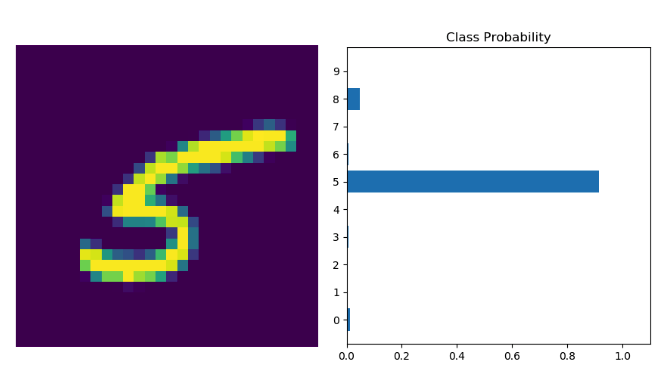

# Prediction of Digital Numbers

A Multi-Layer Perceptron (MLP) implementation with PyTorch to predict handwritten numbers using the MNIST dataset. 

The model is conformed with the following layers:
- The input layer has 784 nodes
- The hidden layer 1 has 128 neurons and a ReLU activation function
- The hideen layer 2 has 64 neurons and a ReLU activation function
- The ouput layer has 10 neurons with an a SoftMax activation function

The image below shows an hadnwriten number on the left and on the right show its class probability precited by the MLP network.

